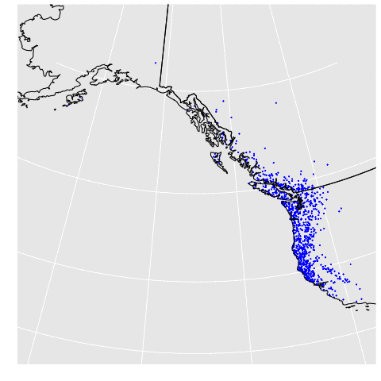

Migratory birds are efficient dispersal agents for a variety of organisms, including the seeds of many plants, ecto and endoparasites, and pathogens like Lyme Disease, West Nile Virus, and Avian Influenza. Many birds migrate thousands of kilometers each year, linking ecosystems across large scales. This linkage means that whatever attaches to, or infects a bird in the tropics may end up in the temperate forests of North America, or vise-versa. I am interested in what these linkages mean for the health of birds and humans.

<h1>
Modeling Migratory Movement
</h1>

Researching topics that rely on understanding the movement of individual migratory birds is difficult because of the incredible diversity of migratory behavior across and within species. One of my projects is focused on creating individual-based models to simulate the movement of birds across time and space. These computational models can then be used to investigate applied questions - like where are ticks that attach to birds likely to be <a href="https://www.sciencedirect.com/science/article/pii/S1877959X18302632">dispersed</a>.

<h1>
Understanding the Causes of Avian Vagrancy
</h1>

Vagrant birds are individuals that are rare in either space or time. These birds often attract a lot of attention from the birdwatchers of the world, and can even attract <a href="https://www.audubon.org/news/a-vagrant-european-robin-drawing-huge-crowds-china">media coverage</a>! Mystery surrounds what causes these birds to end up so far from their normal ranges. I investigate what the causes of this phenomenon may be, as well as the potential ecological consequences.
